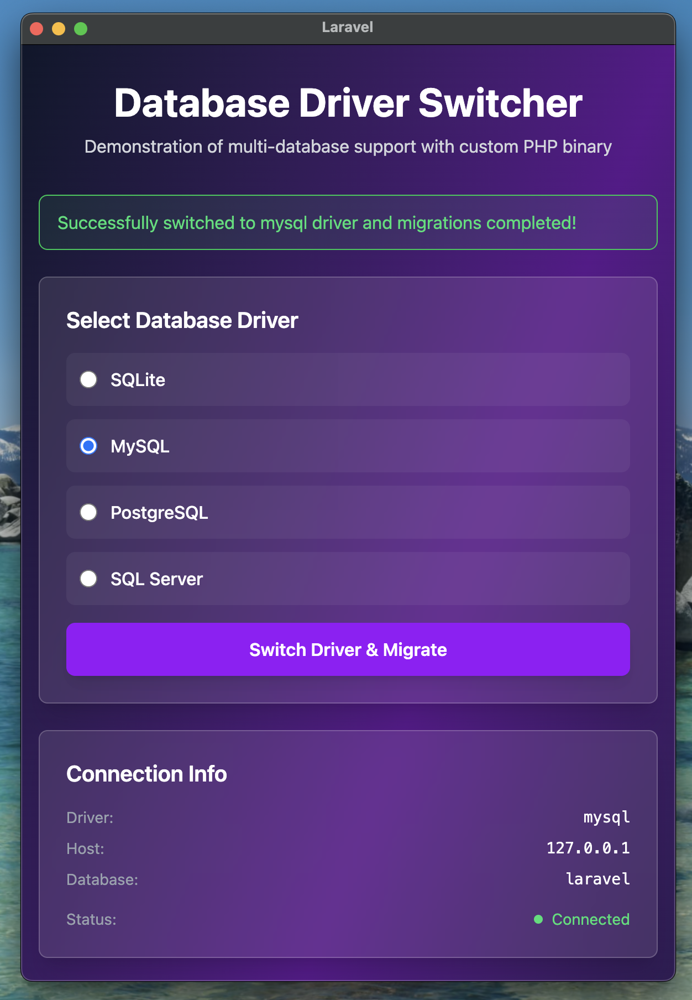
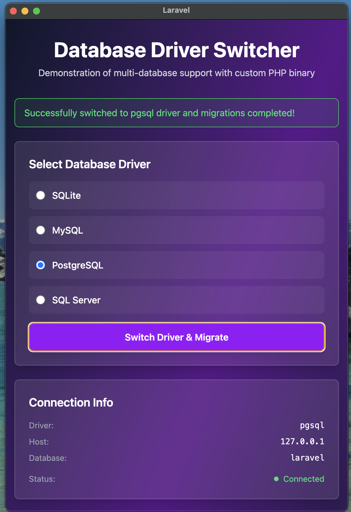

# NativePHP Database Driver Switcher

A Laravel 12 desktop application built with NativePHP/Electron that demonstrates SQL database driver switching capabilities with a custom PHP binary builder (`amohamed/nativephp-ext-cli`) for enhanced database support.

## Features

- 🖥️ **Native Desktop Application** - Built with NativePHP/Electron
- 🔄 **Live Database Driver Switching** - Interactive UI for switching between SQLite, MySQL, PostgreSQL, and SQL Server
- 💫 **Livewire Demo Interface** - Real-time database operations with beautiful gradient UI
- 🛠️ **Custom PHP Binary Builder** - Build static PHP binaries with your choice of extensions
- 📦 **Windows-Optimized Build Process** - Handles Windows-specific compilation challenges
- 🚀 **One-Command Build** - Interactive CLI for building custom PHP binaries
- ✅ **CRUD Operations** - Demonstrate database functionality with add, view, and delete operations

## Tested Platforms

The bundled PHP binaries and NativePHP app have been validated on both **macOS** and **Windows** with the extended driver set (MySQL, PostgreSQL, and SQL Server on Windows). The screenshots below capture the macOS build running the database switcher; Windows builds include the additional SQL Server driver stack.




## Requirements

### For Development
- **PHP 8.3+** - For Laravel 12 and development server
- **Node.js 18+** - For Vite and frontend tooling
- **Composer** - PHP dependency management

### For Building Custom PHP Binaries (Windows)
- **Python 3.8+** - For reliable tar.gz/tar.xz extraction on Windows
  - Handles archives with symlinks gracefully
  - Install from: https://www.python.org/downloads/
- **CMake 3.15+** - Required for building native Windows libraries
  - ⚠️ **CRITICAL**: Must add CMake to system PATH during installation
  - Download from: https://cmake.org/download/
  - Verify: `cmake --version`
- **Visual C++ Build Tools** - Microsoft C++ compiler (MSVC)
  - Automatically detected by php-sdk-binary-tools
- **Git for Windows** - Provides bash, tar, and git commands

### PHP Memory Configuration
- **Minimum 512MB** recommended for building PHP binaries
- Set via: `php -d memory_limit=512M` or edit `php.ini`

## Installation

```bash
# Clone the repository
git clone <repository-url>
cd nativephp-switch-driver-sql

# Install PHP dependencies
composer install

# Install JavaScript dependencies
npm install

# Setup environment
cp .env.example .env
php artisan key:generate

# Create SQLite database
touch database/database.sqlite

# Configure database credentials in .env
# See "Database Configuration" section below

# Run migrations
php artisan migrate
```

## Database Configuration

The application supports multiple database drivers. Configure your credentials in `.env`:

### SQLite (Default)
```env
DB_CONNECTION=sqlite
DB_SQLITE_DATABASE=database/database.sqlite
```

### MySQL
```env
DB_CONNECTION=mysql
DB_MYSQL_HOST=127.0.0.1
DB_MYSQL_PORT=3306
DB_MYSQL_DATABASE=laravel
DB_MYSQL_USERNAME=root
DB_MYSQL_PASSWORD=your_password
```

### PostgreSQL
```env
DB_CONNECTION=pgsql
DB_PGSQL_HOST=127.0.0.1
DB_PGSQL_PORT=5432
DB_PGSQL_DATABASE=laravel
DB_PGSQL_USERNAME=postgres
DB_PGSQL_PASSWORD=your_password
```

### SQL Server
```env
DB_CONNECTION=sqlsrv
DB_SQLSRV_HOST=127.0.0.1
DB_SQLSRV_PORT=1433
DB_SQLSRV_DATABASE=laravel
DB_SQLSRV_USERNAME=sa
DB_SQLSRV_PASSWORD=your_password
```

## Using the Demo Application

1. Start the development server:
   ```bash
   composer dev
   # Or for native app
   composer native:dev
   ```

2. Open your browser to `http://localhost:8000`

3. The homepage displays:
   - **Driver Selector** - Choose between SQLite, MySQL, PostgreSQL, or SQL Server
   - **Connection Info** - View current driver, host, database, and connection status
   - **Add Records** - Create new records with name, description, and active status
   - **Records Table** - View and delete records with driver information

4. Switch drivers by:
   - Selecting a different radio button
   - Click "Switch Driver & Migrate" button
   - The app will connect to the new database and run migrations

## Building Custom PHP Binary

### Quick Start

```bash
# Interactive build with increased memory (recommended)
php -d memory_limit=512M artisan php-ext:install
```

### Command Options

```bash
# Build specific PHP version (with increased memory)
php -d memory_limit=512M artisan php-ext:install --php-version=8.4

# Build specific patch version (with increased memory)
php -d memory_limit=512M artisan php-ext:install --php-version=8.3.13

# Build with specific extensions (non-interactive, with increased memory)
php -d memory_limit=512M artisan php-ext:install --php-version=8.3 --extensions=mysqli,pdo_mysql,soap
```

**Important**: Always use `php -d memory_limit=512M` to avoid memory exhaustion errors during the build process.

### Supported PHP Versions

- **8.1.x** - Full support including SQL Server extensions
- **8.2.x** - Full support including SQL Server extensions
- **8.3.x** - Full support including SQL Server extensions
- **8.4.x** - Supported (SQL Server extensions not available)
- **Custom** - Any specific version (e.g., 8.3.13, 8.4.1)

### Available Extensions

#### Database Extensions
- **MySQL**: `mysqli`, `pdo_mysql`
- **PostgreSQL**: `pgsql`, `pdo_pgsql`
- **SQL Server**: `sqlsrv`, `pdo_sqlsrv` (PHP 8.3 and below)
- **SQLite**: `sqlite3`, `pdo_sqlite` (always included)

#### Extension Packs
- **Web**: `dom`, `xml`, `simplexml`, `gd`
- **Performance**: `opcache`, `phar`
- **Processing**: `iconv`, `ctype`, `bcmath`
- **Compression**: `bz2`
- **Network**: `sockets`
- **SOAP**: `soap`

#### Core Extensions (Always Included)
`pdo`, `mbstring`, `fileinfo`, `tokenizer`, `openssl`, `curl`, `zip`, `zlib`, `session`, `filter`

### Build Output

After successful build:
- **Binary Location**: `static-php-cli/buildroot/bin/php.exe`
- **Build Logs**: `static-php-cli/log/spc.output.log` and `spc.shell.log`

### Verify Built Binary

```bash
# Check PHP version
./static-php-cli/buildroot/bin/php.exe -v

# List loaded extensions
./static-php-cli/buildroot/bin/php.exe -m

# Check specific extension
./static-php-cli/buildroot/bin/php.exe --ri mysqli
```

## Development Commands

### Development Server
```bash
# Run Laravel + Vite + Queue worker concurrently
composer dev

# Run NativePHP native app with Vite
composer native:dev

# Laravel development server only
php artisan serve

# Vite dev server for assets
npm run dev
```

### Testing
```bash
# Run full test suite
composer test

# Run Pest tests directly
./vendor/bin/pest

# Run specific test
./vendor/bin/pest --filter=ExampleTest
```

### Code Quality
```bash
# PHP CS Fixer (Laravel Pint)
./vendor/bin/pint

# Static analysis (PHPStan level 7)
./vendor/bin/phpstan analyse

# Code refactoring (Rector)
./vendor/bin/rector process
```

### Database
```bash
php artisan migrate
php artisan db:seed
```

### Assets
```bash
npm run build
```

## How It Works

### Custom PHP Binary Build Process

1. **Setup Phase**: Clones `static-php-cli` and `php-sdk-binary-tools`
2. **Download Phase**: Downloads PHP source, libraries, and extensions
3. **Pre-extraction Phase**: Uses Python to extract sources (Windows-safe)
4. **Library Extraction**: Handles symlinks and Windows path issues
5. **Build Phase**: Compiles PHP with MSVC and selected extensions
6. **Verification Phase**: Tests the compiled binary

### Windows-Specific Adaptations

- **Symlink Handling**: Python script skips symlinks (Windows limitation)
- **Path Conversion**: Automatic Windows ↔ Unix path conversion
- **GitHub Fallback**: Auto-clones from GitHub when downloads fail
- **Hash Files**: Prevents re-extraction of pre-extracted sources
- **Windows-Optimized Repos**: Uses `winlibs` for better compatibility

## Troubleshooting

### Memory Exhaustion Error
```
Allowed memory size of 134217728 bytes exhausted
```
**Solution**:
```bash
php -d memory_limit=512M artisan php-ext:install
```

### CMake Not Found
```
'cmake' is not recognized as an internal or external command
```
**Solution**:
1. Install CMake from https://cmake.org/download/
2. Select "Add CMake to system PATH" during installation
3. Restart terminal
4. Verify: `cmake --version`

### MSVC Compiler Errors (C4146, C4703)
```
error C4146: unary minus operator applied to unsigned type
```
**Cause**: PHP 8.3.26+ has code patterns triggering strict MSVC warnings

**Workaround**:
1. Try building without SQL Server extensions
2. Use PHP 8.3.13 (known stable version)
3. Retry - sometimes transient compiler issues resolve

### Python Unicode Error
```
UnicodeEncodeError: 'charmap' codec can't encode character
```
**Status**: Fixed - Script uses ASCII-safe output

### Symlink Errors
```
tar: Cannot create symlink
```
**Status**: Fixed - Python script skips symlinks automatically

### Clean Build
If build fails repeatedly:
```bash
rm -rf static-php-cli
php -d memory_limit=512M artisan php-ext:install
```

## Project Structure

```
├── app/
│   ├── Livewire/
│   │   └── DatabaseDemo.php              # Database driver switcher component
│   └── Providers/
│       └── NativeAppServiceProvider.php  # NativePHP configuration
├── config/
│   ├── database.php                       # Multi-driver database connections
│   ├── nativephp.php                      # Native app settings
│   └── nativephp-custom-php.php          # Custom PHP build config
├── resources/views/
│   ├── layouts/
│   │   └── app.blade.php                 # Livewire layout
│   └── livewire/
│       └── database-demo.blade.php       # Database switcher UI
├── database/migrations/
│   └── 2025_10_02_*_create_database_demos_table.php
├── vendor/amohamed/nativephp-ext-cli/
│   └── src/Commands/
│       ├── InstallPhpExtensions.php      # Main build command
│       └── extract_php_source.py         # Windows extraction script
├── static-php-cli/                        # Build artifacts (gitignored)
│   ├── buildroot/bin/php.exe             # Built PHP binary
│   └── log/                               # Build logs
├── CLAUDE.md                              # Developer documentation
└── README.md                              # This file
```

## Technology Stack

- **Backend**: Laravel 12 (PHP 8.3+)
- **Frontend**: Livewire + Vite + Tailwind CSS 4.x
- **Desktop**: NativePHP/Electron
- **Testing**: Pest
- **Code Quality**: Laravel Pint, PHPStan (Level 7), Rector
- **Database**: SQLite (default), MySQL, PostgreSQL, SQL Server
- **Build Tools**: static-php-cli, php-sdk-binary-tools, CMake, Python
- **Package**: `amohamed/nativephp-ext-cli` - Custom PHP binary builder

## Contributing

1. Fork the repository
2. Create a feature branch (`git checkout -b feature/amazing-feature`)
3. Commit your changes (`git commit -m 'Add amazing feature'`)
4. Push to the branch (`git push origin feature/amazing-feature`)
5. Open a Pull Request

## License

[Your License Here]

## Support

For issues and questions:
- Check [CLAUDE.md](CLAUDE.md) for detailed developer documentation
- Review build logs in `static-php-cli/log/`
- Open an issue on GitHub

## Acknowledgments

- [static-php-cli](https://github.com/crazywhalecc/static-php-cli) - PHP static compiler
- [NativePHP](https://nativephp.com/) - Laravel desktop app framework
- [Laravel](https://laravel.com/) - PHP web framework
